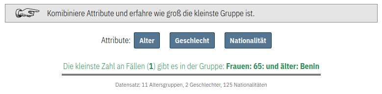

## Datenschutzkonforme Erhebung von Nutzer\*innendaten

### Datensparsamkeit & Datenvermeidung

Grundsätzlich sollte bei jeder Form von Datenerhebung nur die Daten gesammelt werden, die zwingend notwendig sind. Während dies auf den ersten Blick völlig offensichtlich erscheint, verfolgen viele die Strategie so viele Daten wie möglich zu erheben, um z.B. nachträglich noch nicht vorgesehene Analysen zu machen. Die essentiellen Daten zu identifizieren verlangt sich im vornherein mehr Gedanken über die Nachnutzung der Daten zu machen. Verfolgt man aber diesen Ansatz, kann man die Nutzer\*innen sehr transparent darüber informieren, wozu ihre Daten genutzt werden. Gleichzeitig kann der individuelle Fußabdruck der Datensammlung verringert werden.

### Trennen von Datenbeständen

Gleichzeitig sollte definiert werden, ob es zwingend notwendig ist statistische Daten wie z.B. demographische Daten mit den Nutzerdaten (z.B. Username, Email, Passwort) abzuspeichern. Im Falle eines potentiellen Datendiebstahls, könnten sonst kriminielle die Nutzerdaten, wie Email-Adressen, spezifischen demographischen Attributen zuordnen. Ein Beispiel im Kontext der Befragung der Bürger\*innen wo es Sinn macht diese beiden Ebenen zu trennen:

**Ziel**: Man möchte im Laufe des Prozesses und nach Abschluss des Projektes sicherstellen, dass eine möglichst gute Stichprobe der Bevölkerung an der Umfrage teilgenommen haben.

**Dimensionen**: Geschlecht, Alter und räumliche Verortung

**Abfragemethoden**:
1. Geschlecht: Aus Inklusionsgründen sollte hier ein breites Spektrum an Möglichkeiten angeboten werden. Dies birgt aber die Gefahr, dass Informationen über eine sehr kleine Untergruppe der Bevölkerung erhoben werden. Hier muss abgewogen werden, wie fein die Optionen und wie gut der Schutz der Privatsphäre sein soll.
2. Alter: Für das gestellte Ziel sollte es ausreichen grobe Altersklassen zu bilden.
3. Räumliche Verordnung: Umso gröber die räumliche Auflösung, umso höher der Schutz der Privatsphäre. In vielen Fällen wird es wahrscheinlich ausreichen Bundesländer oder z.B. Postleitzahlen zu erheben.

**Speicherung**: Sind wir nur daran interessiert, dass die Fragen von einer guten Stichprobe der Gesellschaft gestellt werden, könnte man die demographischen Daten komplett von den Fragen und den Nutzerdaten trennen. So könnte man nachher die demographischen Attribute weder Fragen noch Personen zuordnen. Könnte aber trotzdem Aussagen über die Stichprobe treffen.

#### 2.2.1 Implementierung

Im Prototypen haben wir die Trennung von demographischen Daten und Nutzerdaten exemplarisch implementiert. Siehe hierzu [Prototypen-Dokumentation](chapter05.md).

### Privatsphärenschutz und das Erheben von Attributen

Das vorsichtige Abwägen beim Erheben von personenbezogenen Attributen ist notwendig, da über diese Personen in der realen Welt identifiziert werden können. Dies kann zum einen passieren, weil es innerhalb der untersuchten Zielgruppe sehr kleine Untergruppen mit bestimmten Attributen gibt. Wenn in der Datenbank nun eine Datensatz vorliegt, welcher genau diese seltenen Attribute hat, können wir diesen Datensatz einer Person zuordnen (oder wissen zumindest das eine von N Personen diesen Datensatz erstellt hat). Neben einer direkten Zuordnung darf nicht vergessen werden, dass diverse Unternehmen bereits enorme Mengen persönlicher Daten gesammelt haben. Kombiniert man diese mit den neu erhobenen Daten, können möglicherweise auch Rückschlüsse auf Individuen generiert werden.

Um diese Gefahren ganz praktisch anhand einiger Beispiele zu demonstrieren, haben wir eine [**interaktive Demo**](https://sampling.locobss.vislab.io/?lang=de) entwickelt.

<figure>
<figcaption>Demo: Daten erheben & die Privatsphäre schützen</figcaption>

</figure>

### Möglichkeiten zur Erhebung sensibler Information

In manchen Fällen möchte man vllt. Daten erheben die sehr persönlich sind und eventuell die Privatsphäre von Individuen gefährden. Nehmen wir als Beispiel den exakten Wohnort der Person. Sollten wir tatsächlich konkrete Kontaktinformationen benötigen, z.B. zum postalischen Kontakt, müssen die Daten selbstverständlich erhoben werden (aber auch hier sollte erruiert werden, ob z.B. ein Trennen von Daten Sinn macht). In einigen Fällen wird der Wohnort aber nur erhoben, weil man davon ausgehend andere Attribute ableiten möchte, z.B. wohnt jemand in einer Großstadt oder eher auf dem Land. In all solchen Fällen, in denen hochaufgelöste Attribute erhoben werden, um anschließend niedrieg aufgelöste Attribute abzuleiten, empfiehlt es sich, dieses Ableiten direkt im Browser, auf Seiten der Nutzer\*innen durchzuführen. Ist man z.B. daran interessiert, ob jemand in Großstadt oder auf dem Land wohnt, kann man eine einfache Postleitzahlabfrage integrieren und statt der Postleitzahl selber, das Attribut Stadt/Land zurückgeben. Solche **client-side classifications** sind für die Entwickler\*innen komplexer zu implementieren, können aber so implementiert werden, dass diese für die Nutzer\*innen keinen Unterschied in der Performance oder Interaktion darstellen.

Um diese Methode der **client-side classification** zu demonstrieren, haben wir eine [**interaktive Demo**](https://privacy.locobss.vislab.io?lang=de) entwickelt.

<figure>
<figcaption>Demo: Client-side Classification</figcaption>

</figure>

#### Implementierung

Im Prototypen haben wir die Trennung von demographischen Daten und Nutzerdaten exemplarisch implementiert. Zusätzlich haben wir die oben beschriebene client-side classification implementiert. Beispielhaft wird hierzu die eingegebene Postleitzahl genutzt, um direkt im Browser die [RegioStar Gem5](https://www.bmvi.de/SharedDocs/DE/Artikel/G/regionalstatistische-raumtypologie.html) Klasse zu identifizieren (Metropole; Regiopole, Großstadt; Zentrale Stadt, Mittelstadt; Städtischer Raum; Kleinstädtischer / dörflicher Raum). Siehe hierzu [Prototypen-Dokumentation](chapter05.md).

<figure>
<figcaption>Prototyp: Formular zum Stellen einer Frage</figcaption>

</figure>

Weiterhin haben wir bei der Implementierung versucht sogenannte "Dark Design Patterns" zu vermeiden und "Ethical Design" Prinzipien zu verfolgen:

1. Nur die Felder zu Pflichtfeldern machen, die wirklich notwendig sind. Pflichtfelder können Personen auch davon abschrecken den Ausfüllprozess abzuschließen.
2. Möglichst barrierearme Anforderungen an die Eingaben stellen (z.B. mindest oder maximale Zeichenzahlen, Passwortvorgaben, etc.)
3. Transparent erklären wozu welche Daten erhoben werden und was damit geschieht. Zum Beispiel transparent erklären, warum demographische Daten erhoben werden und wie diese verarbeitet werden.
4. Opt-in und nicht Opt-out. Stattdessen sollten die Vorteile einer Registrierung deutlich gemacht werden und die Wahl der Nutzer\*in überlassen werden.
5. Sicherheitsmaßnahmen und Privatsphäre müssen häufig abgewägt werden. Wenn wir Bürger\*innen erlauben wollen Fragen zu stellen, ohne z.B. vorher ihre Email-Adresse zu validieren, müssen wir andere Maßnahmen integrieren, um illegale Aktivitäten auf der Seite zu verhindern. Wir haben als Beispielhafte Lösung [reCaptcha](https://developers.google.com/recaptcha/docs/display) implementiert. Wir haben explizit Version 2 genutzt, da die Privatsphäre bei dieser Variante besser geschützt wird.
