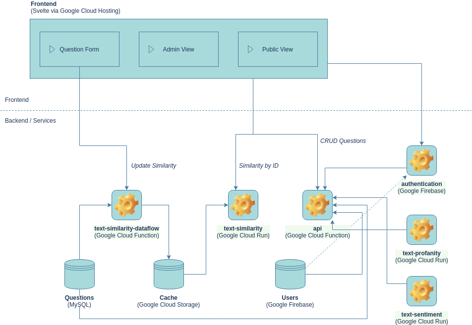

**LoCobSS documentation**
# Teil 5 - Prototyp: Technische Dokumentation

## Overview

### Service Repositories
- [LoCobSS-platform](https://www.github.com/sebastian-meier/LoCobSS-platform)
- [LoCobSS-text-similarity](https://www.github.com/sebastian-meier/LoCobSS-text-similarity)
- [LoCobSS-text-similarity-dataflow](https://www.github.com/sebastian-meier/LoCobSS-text-similarity-dataflow)
- [LoCobSS-text-profanity](https://www.github.com/sebastian-meier/LoCobSS-text-profanity)
- [LoCobSS-text-sentiment](https://www.github.com/sebastian-meier/LoCobSS-text-sentiment)
- [LoCobSS-authentication-UI](https://www.github.com/sebastian-meier/LoCobSS-authentication-UI)
- [LoCobSS-dwd-transform](https://www.github.com/sebastian-meier/LoCobSS-dwd-transform)
- [LoCobSS-co2-data](https://www.github.com/sebastian-meier/LoCobSS-co2-data)
- LoCobSS-stories...